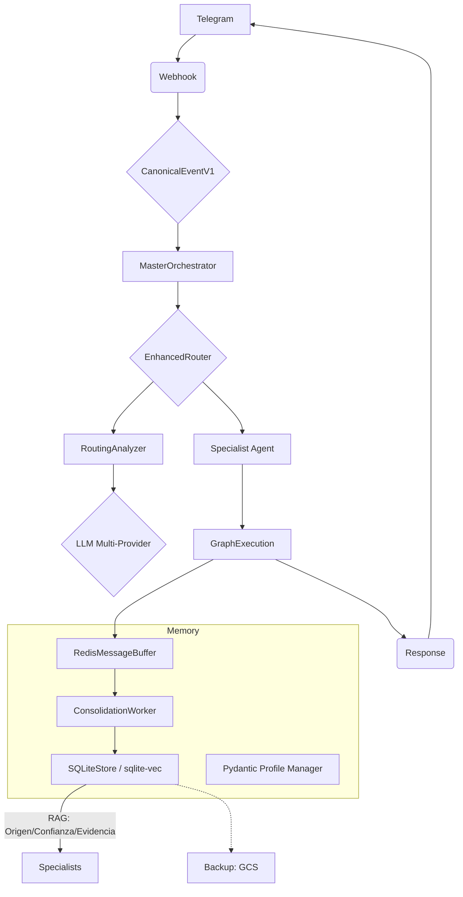

# AEGEN: Plataforma de Orquestación de Agentes Multi-Especialistas

> **MAGI:** El Asistente Conversacional (Interfaz Principal)
> **Versión:** 0.7.0 (Structural Saneamiento)
> **Estado:** Saneamiento y Automatización en Progreso 🔄
> **Branch Actual:** `develop`

<!-- LLM-Hint: AEGEN es la infraestructura. MAGI es el agente conversacional que el usuario ve. MAGI utiliza el MasterOrchestrator para delegar tareas a especialistas como el Agente TCC. Este documento es la Fuente de Verdad. -->

## 🎯 Contexto Actual del Proyecto

### Estado Real
El estado del proyecto se gestiona automáticamente a través de la arquitectura y la documentación técnica consolidada.
Para ver el estado de salud del sistema, ejecutar: `make verify`

## 📖 1. Filosofía de Desarrollo

### Principios Core (Inmutables)
1. **Arquitectura Evolutiva:** De monolito funcional → sistema distribuido cuando las métricas lo justifiquen.
2. **Pragmatismo Medible:** Complejidad solo si ROI > umbral definido.
3. **Gobernanza Automática:** Las reglas se ejecutan, no se recuerdan.
4. **LLM-First:** Diseñado para ser usado y entendido por IA.
5. **Observabilidad Nativa:** Métricas y trazas desde el día 1.

### Patrones de Diseño
- **Event-Driven:** `CanonicalEventV1` como lingua franca.
- **Registry Pattern:** Autodescubrimiento de especialistas.
- **State Graphs:** LangGraph para orquestación declarativa.
- **Provenanced Memory:** Cada dato guardado tiene origen, confianza y evidencia.

## 🏗️ 2. Arquitectura de MAGI

### Estructura de Directorios Consolidada
```
AEGEN/
├── src/
│   ├── agents/          # Orquestador y Especialistas (CBT, Chat, etc.)
│   ├── api/             # FastAPI Routers (Webhooks, Privacy, Status)
│   ├── core/            # Schemas (Pydantic), Dependencies, Engine
│   ├── memory/          # SQLite Store, Ingestion Pipeline, Search
│   └── tools/           # Telegram Interface, Speech, Bulk Ingestor
├── scripts/             # Herramientas de mantenimiento y automatización
├── docs/                # Documentación Técnica
│   ├── architecture/    # Subsistemas (Memoria, Personalidad, Observabilidad)
│   ├── guides/          # Desarrollo, Despliegue, Redis
│   └── archive/         # Documentos legacy y ADRs superados
└── adr/                 # Architecture Decision Records (Decisiones Vigentes)
```

### Flujo de Datos (Local-First & Provenance)


## 🗺️ 3. Roadmap y Evolución

### 🌟 FASE 7: Saneamiento y Automatización (v0.7.0 - ACTUAL)
- **The Great Purge:** Eliminación de código legacy (Google File API) y scripts obsoletos.
- **Auto-Sync Watcher:** Indexación en tiempo real de archivos en `storage/knowledge/`.
- **Bulk Ingestion:** Importación de historiales de ChatGPT/Claude para "Life Review".
- **Smart Decay:** Algoritmo de olvido inteligente (ponderación temporal).
- **Linguistic Flex:** Refactor del Prompt Builder para eliminar acentos forzados.

### 🚀 FASE 8: Ecosistema de Micro-Especialistas (Skills)
- **Habilidades Atómicas:** Integración de herramientas externas críticas:
    - **Google Search:** Búsqueda en tiempo real para temas de actualidad.
    - **Google Calendar:** Gestión de agenda y recordatorios.
    - **File Management:** Capacidad de leer y organizar archivos complejos.
- **Skill Creator Tool:** Herramienta automatizada para generar y registrar nuevos especialistas y herramientas sin tocar el código core.
- **Anti-Alucinación (Fact Checker):** Verificador de hechos post-generación que cruza la respuesta del bot con la Bóveda de Conocimiento antes de enviarla al usuario.

### ✅ Hitos Completados (Historial de Evolución)
- **Gobernanza y Seguridad Clínica (v0.6.0):** Provenance, Pydantic Profiles, Privacy Layer y Guardrails CBT.
- **Evolución de Memoria (Fase F):** Migración a SQLite + sqlite-vec + FTS5, Ranking RRF.
- **Identidad Estructural (Fase E):** Captura de `first_name`, sincronización Knowledge -> Profile y blindaje de prompts.
- **Memoria Híbrida y Precisión Clínica (Fase D):** FactExtractor, KnowledgeBase local y extracción incremental.
- **Localización y Consistencia (Fase C):** Extracción de `language_code` y jerga regional.
- **Robustez RAG (Fase B):** Extracción JSON robusta y sincronización inteligente.
- **Enrutamiento Inteligente (Fase A):** Contexto enriquecido, lógica de "Stickiness" y afinidad.
- **Sistema Conversacional Básico (v0.3.0):** Implementación de MasterRouter y memoria persistente.

## 🚀 4. Guía Rápida para Desarrolladores

### Comandos de Calidad
```bash
make verify       # CI completa (lint + test + security)
make format       # Corrección automática de estilo
docker-compose logs -f app # Ver transparencia RAG en tiempo real
```

---
**🚀 Este documento es la fuente de verdad del proyecto.**

### 📊 Estado Operativo (Autosync)
- Branch_Trabajo: "develop"
- Cambios_Pendientes: ['adr/ADR-0004-Ruff-Consolidation.md', 'adr/ADR-0005-Conversational-Memory-Architecture.md', 'adr/ADR-0003-Dynamic-Tool-Based-Routing.md', 'adr/ADR-0001-MasterRouter.md', 'src/main.py']
- Última_Sincronización: "2026-02-11 10:08"
