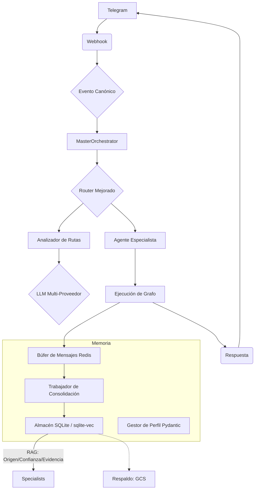

# AEGEN: Plataforma de Orquestación de Agentes Multi-Especialistas

> **MAGI:** El Asistente Conversacional (Interfaz Principal)
> **Versión:** 0.7.0 (Saneamiento Estructural)
> **Estado:** Saneamiento y Automatización en Progreso 🔄
> **Branch Actual:** `develop`

<!-- LLM-Hint: AEGEN es la infraestructura. MAGI es el agente conversacional que el usuario ve. MAGI utiliza el MasterOrchestrator para delegar tareas a especialistas como el Agente TCC. Este documento es la Fuente de Verdad. -->

## 🎯 Contexto Actual del Proyecto

### Estado Real
El estado del proyecto se gestiona automáticamente a través de la arquitectura y la documentación técnica consolidada en la carpeta `docs/`.
Para ver el estado de salud del sistema, ejecutar: `make verify`

## 📖 1. Filosofía de Desarrollo

### Principios Core (Inmutables)
1. **Arquitectura Evolutiva:** De monolito funcional → sistema distribuido cuando las métricas lo justifiquen.
2. **Pragmatismo Medible:** Complejidad solo si ROI (Retorno de Inversión) > umbral definido.
3. **Gobernanza Automática:** Las reglas se ejecutan mediante scripts, no solo se recuerdan.
4. **LLM-First (IA Primero):** Diseñado para ser usado y entendido por Inteligencias Artificiales.
5. **Observabilidad Nativa:** Métricas y trazas implementadas desde el inicio.

### Patrones de Diseño
- **Event-Driven (Basado en Eventos):** `CanonicalEventV1` como lenguaje común del sistema.
- **Registry Pattern (Patrón de Registro):** Autodescubrimiento de especialistas y herramientas.
- **State Graphs (Grafos de Estado):** Uso de LangGraph para orquestación declarativa.
- **Provenanced Memory (Memoria con Procedencia):** Cada dato guardado tiene origen, confianza y evidencia.

## 🏗️ 2. Arquitectura de MAGI

### Estructura de Directorios Consolidada
```
AEGEN/
├── src/
│   ├── agents/          # Orquestador y Especialistas (CBT, Chat, etc.)
│   ├── api/             # Routers de FastAPI (Webhooks, Privacidad, Estado)
│   ├── core/            # Esquemas (Pydantic), Dependencias, Motor LLM
│   ├── memory/          # Almacén SQLite, Pipeline de Ingesta, Búsqueda
│   └── tools/           # Interfaz Telegram, Voz, Ingestor Masivo
├── scripts/             # Herramientas de mantenimiento y automatización
├── docs/                # Documentación Técnica
│   ├── architecture/    # Subsistemas (Memoria, Personalidad, Calidad)
│   ├── guides/          # Guías de Desarrollo, Despliegue y Redis
│   ├── plans/           # Planes Detallados de Desarrollo (Plan Maestro)
│   └── archive/         # Documentos antiguos y decisiones superadas
└── adr/                 # Architecture Decision Records (Decisiones de Arquitectura Vigentes)
```

### Flujo de Datos (Local-First y Trazabilidad)


## 🗺️ 3. Hoja de Ruta (Roadmap) y Evolución

### 🌟 Bloque A: Saneamiento y Autonomía (Fase Actual)
- **Purga de Código Antiguo:** Eliminación total de rastro de Google File API y scripts obsoletos.
- **Unificación de Persistencia:** Migración de carpetas redundantes hacia un único directorio `/storage`.
- **Vigilante Automático (Auto-Sync):** Indexación en tiempo real de archivos nuevos en `storage/knowledge/`.
- **Flexibilidad Lingüística:** Refactorización del motor de instrucciones para eliminar acentos forzados y permitir imitación natural.

### 🚀 Bloque B: Expansión de Memoria y Contexto
- **Ingesta Masiva:** Herramientas para importar historiales externos (ChatGPT, Claude, WhatsApp).
- **Agente de Revisión de Vida (Life Review):** Especialista para extraer patrones de largo plazo (valores, hitos, red de apoyo).
- **Olvido Inteligente (Smart Decay):** Algoritmo de ponderación temporal para priorizar la información reciente.

### 🛠️ Bloque C: Ecosistema de Acción (Habilidades)
- **Fábrica de Habilidades (Skill Creator):** Infraestructura para añadir herramientas externas sin tocar el núcleo del sistema.
- **Integración de Herramientas de Acción:** Despliegue de habilidades como búsqueda web, gestión de agenda y archivos, según viabilidad técnica.
- **Verificador de Verdad (Fact Checker):** Validación post-generación contra la Bóveda de Conocimiento para eliminar alucinaciones.

### ✅ Hitos Completados
- **Gobernanza y Seguridad Clínica (v0.6.0):** Implementación de procedencia (provenance), perfiles Pydantic y reglas de seguridad CBT.
- **Evolución de Memoria (v0.3.0):** Migración a SQLite local con búsqueda vectorial y léxica híbrida.
- **Identidad Estructural:** Captura de nombre y estilo desde la plataforma y sincronización con el perfil evolutivo.

## 🚀 4. Guía Rápida para Desarrolladores

### Comandos de Calidad
```bash
make verify       # Validación completa (lint + test + arquitectura)
make format       # Corrección automática de estilo de código
docker-compose logs -f app # Seguimiento de la transparencia RAG en vivo
```

---
**🚀 Este documento es la fuente de verdad del proyecto.**

### 📊 Estado Operativo (Sincronización Automática)
- Branch_Trabajo: "main"
- Cambios_Pendientes: []
- Última_Sincronización: "2026-02-11 00:00"
