# AEGEN: Plataforma de Apoyo Universal y Amistad Inteligente

> **MAGI:** Tu amigo cercano y refugio universal (Interfaz Principal)
> **Versión:** 0.8.0 (Overhaul Personalidad Completado)
> **Estado:** Estable ✅
> **Branch Actual:** `develop`

<!-- LLM-Hint: AEGEN es la infraestructura técnica. MAGI es el amigo cercano que el usuario ve. MAGI es un refugio universal para cualquier necesidad (psicológica, laboral, cotidiana). MAGI utiliza el MasterOrchestrator para actuar como Guía en diferentes contextos. Este documento es la Fuente de Verdad. -->

## 🎯 Contexto Actual del Proyecto

### Estado Real
El estado del proyecto se gestiona automáticamente a través de la arquitectura y la documentación técnica consolidada en la carpeta `docs/`.
Para ver el estado de salud del sistema, ejecutar: `make verify`

## 📖 1. Filosofía de Desarrollo

### Principios Core (Inmutables)
1. **Arquitectura Evolutiva:** De monolito funcional → sistema distribuido cuando las métricas lo justifiquen.
2. **Pragmatismo Medible:** Complejidad solo si ROI (Retorno de Inversión) > umbral definido.
3. **Gobernanza Automática:** Las reglas se ejecutan mediante scripts, no solo se recuerdan.
4. **LLM-First (IA Primero):** Diseñado para ser usado y entendido por Inteligencias Artificiales.
5. **Observabilidad Nativa:** Métricas y trazas implementadas desde el inicio.

### Patrones de Diseño
- **Event-Driven (Basado en Eventos):** `CanonicalEventV1` como lenguaje común del sistema.
- **Registry Pattern (Patrón de Registro):** Autodescubrimiento de especialistas y herramientas.
- **State Graphs (Grafos de Estado):** Uso de LangGraph para orquestación declarativa.
- **Provenanced Memory (Memoria con Procedencia):** Cada dato guardado tiene origen, confianza y evidencia.

## 2. Arquitectura de MAGI

### Estructura de Directorios Consolidada
```
AEGEN/
├── src/
│   ├── agents/          # Orquestador y Especialistas (CBT, Chat, etc.)
│   ├── api/             # Routers de FastAPI (Webhooks, Privacidad, Estado)
│   ├── core/            # Esquemas (Pydantic), Dependencias, Motor LLM
│   ├── memory/          # Almacén SQLite, Pipeline de Ingesta, Búsqueda
│   └── tools/           # Interfaz Telegram, Voz, Ingestor Masivo
├── scripts/             # Herramientas de mantenimiento y automatización
├── docs/                # Documentación Técnica
│   ├── arquitectura/    # Subsistemas detallados (Core, Agentes, Memoria, etc.)
│   ├── guias/           # Manuales de [Desarrollo](docs/guias/manual-desarrollo.md) y [Despliegue](docs/guias/manual-despliegue.md)
│   └── planes/          # Planes Detallados de Desarrollo (Plan Maestro)
└── adr/                 # Architecture Decision Records (Decisiones de Arquitectura Vigentes)
```

### Flujo de Datos (Local-First y Trazabilidad)

```mermaid
graph TD
    A[Telegram] --> B(Webhook);
    B --> C{Evento Canónico};
    C --> D[MasterOrchestrator];
    D --> E{Router Mejorado};
    E --> F[Analizador de Rutas];
    F --> G{LLM Multi-Proveedor};
    E --> H[Agente Especialista];
    H --> I[Ejecución de Grafo];
    I --> J[Búfer de Mensajes Redis];
    J --> K[Trabajador de Consolidación];
    K --> L[Almacén SQLite / sqlite-vec];
    L -- "RAG: Origen/Confianza/Evidencia" --> Specialists;
    L -.-> M[Respaldo: GCS];
    I --> N(Respuesta);
    N --> A;

    Z[PDFs en storage/knowledge] -.-> Y[KnowledgeWatcher];
    Y -- "Async Polling (Auto-Sync)" --> L;

    subgraph Memoria
        J
        K
        L
        O[Gestor de Perfil Pydantic]
        Y
    end
```


## 🗺️ 3. Hoja de Ruta (Roadmap) y Evolución

### 🌟 Bloque A: Saneamiento y Autonomía (Fase Actual)
- **Overhaul de Personalidad:** Completado (v0.8.0). Implementación de "Eco Léxico", "Neutralidad Cálida" y Soul Stack v2 para una conexión real sin acentos forzados.

### 🚀 Bloque B: Expansión de Memoria y Contexto
- **Ingesta Masiva:** Herramientas para importar historiales externos (ChatGPT, Claude, WhatsApp).
- **Agente de Revisión de Vida (Life Review):** Especialista para extraer patrones de largo plazo (valores, hitos, red de apoyo).
- **Olvido Inteligente (Smart Decay):** Algoritmo de ponderación temporal para priorizar la información reciente.

### 🛠️ Bloque C: Ecosistema de Acción (Habilidades)
- **Fábrica de Habilidades (Skill Creator):** Infraestructura para añadir herramientas externas sin tocar el núcleo del sistema.
- **Integración de Herramientas de Acción:** Despliegue de habilidades como búsqueda web, gestión de agenda y archivos, según viabilidad técnica.
- **Verificador de Verdad (Fact Checker):** Validación post-generación contra la Bóveda de Conocimiento para eliminar alucinaciones.

### ✅ Hitos Completados
- **Overhaul de Personalidad (v0.8.0):** Arquitectura de 5 capas (Identidad → Alma → Espejo → Skill → Runtime) y motor de análisis de estilo lingüístico.
- **Auto-Sync de Memoria (v0.7.3):** Implementación de `KnowledgeWatcher` para indexación en tiempo real de documentos mediante polling asíncrono.
- **Containerización del Polling (v0.7.2):** Integración del servicio de polling en Docker para resiliencia y desacoplamiento del host.
- **Refactorización Integral (v0.7.1):** Eliminación de violaciones SRP y límites de LOC. Reestructuración de Webhooks, Routing, Memory y Logging.
- **Gobernanza y Seguridad Clínica (v0.6.0):** Implementación de procedencia (provenance), perfiles Pydantic y reglas de seguridad CBT.
- **Evolución de Memoria (v0.3.0):** Migración a SQLite local con búsqueda vectorial y léxica híbrida.
- **Identidad Estructural:** Captura de nombre y estilo desde la plataforma y sincronización con el perfil evolutivo.

## 🚀 4. Guía Rápida para Desarrolladores

### Comandos de Calidad
```bash
make verify       # Validación completa (lint + test + arquitectura)
make format       # Corrección automática de estilo de código
docker-compose logs -f app # Seguimiento de la transparencia RAG en vivo
```

---
**🚀 Este documento es la fuente de verdad del proyecto.**

### 📊 Estado Operativo (Sincronización Automática)
- Branch_Trabajo: "develop"
- Cambios_Pendientes: []
- Última_Sincronización: "2026-02-11 19:20"
