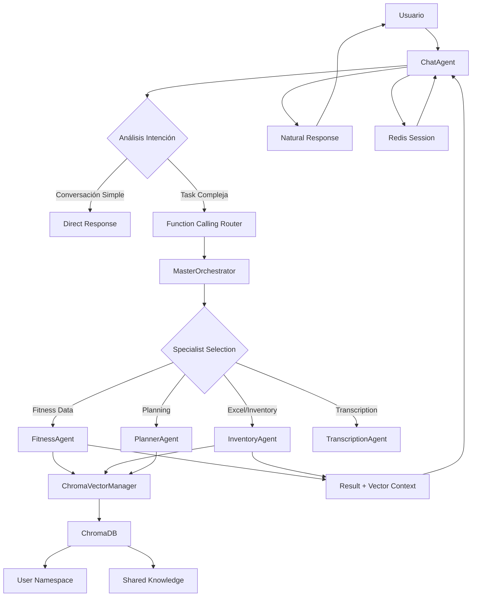

# ADR-0007: Phase 3C - ChromaDB Vector Database + Multi-Agent Architecture

**Fecha:** 2025-08-22
**Estado:** 🚧 EN PLANIFICACIÓN - Iniciando Implementación
**Decisores:** Equipo AEGEN + Expert Validation (Gemini)

## Contexto y Motivación

### Estado Post-Phase 3B

Después de completar exitosamente Phase 3B con refactorización arquitectónica completa, AEGEN tiene:

✅ **Arquitectura Sólida:**
- Strategy Pattern con 7 componentes clean
- Lazy initialization thread-safe
- Conversational memory bidireccional
- ChatAgent como único punto de entrada

✅ **Funcionalidad Conversacional:**
- Sistema conversacional completo funcional
- Memoria Redis persistente (TTL 1h)
- Audio + texto con chaining inteligente
- LangSmith observability operacional

### Necesidades Identificadas para Phase 3C

El sistema actual necesita evolucionar para soportar:

1. **📊 Análisis de Datos Especializado:** Usuarios requieren análisis inteligente de datos fitness/nutrición/inventario
2. **🔒 Privacy-First Data Management:** Separación clara entre datos de usuario vs conocimiento compartido
3. **🧠 Vector Search Capabilities:** Búsqueda semántica para knowledge retrieval
4. **👥 Multiple Domain Specialists:** FitnessAgent, InventoryAgent para tareas específicas
5. **📈 Scalable Knowledge Base:** ChromaDB como foundation para future knowledge expansion

## Decisión Arquitectónica

### Solución: ChromaDB Vector Database + Privacy-First Multi-Agent Architecture

Implementar una arquitectura que combine:

1. **ChromaDB Integration** con user namespacing para privacy
2. **Multiple Specialist Agents** para dominios específicos
3. **Vector Search Layer** para knowledge retrieval
4. **Privacy-First Data Architecture** con separación user/shared knowledge

### Nueva Arquitectura Propuesta



## Implementación por Componentes

### 1. ChromaDB Vector Manager

```python
# src/core/vector/chroma_manager.py
class ChromaVectorManager:
    """
    Privacy-first vector database manager with user namespacing.
    """
    
    def __init__(self):
        self.client = chromadb.PersistentClient(path="./chroma_data")
        self.embeddings = SentenceTransformer('all-MiniLM-L6-v2')
        
    async def get_user_collection(self, user_id: str) -> Collection:
        """Get or create user-specific collection."""
        collection_name = f"user_{user_id}"
        return self.client.get_or_create_collection(
            name=collection_name,
            metadata={"privacy": "user_private", "user_id": user_id}
        )
    
    async def get_shared_collection(self) -> Collection:
        """Get shared knowledge collection."""
        return self.client.get_or_create_collection(
            name="shared_knowledge",
            metadata={"privacy": "shared_public"}
        )
    
    async def search_user_knowledge(
        self, 
        user_id: str, 
        query: str, 
        n_results: int = 5
    ) -> List[Dict[str, Any]]:
        """Search in user's private knowledge base."""
        collection = await self.get_user_collection(user_id)
        query_embedding = self.embeddings.encode([query])
        
        results = collection.query(
            query_embeddings=query_embedding.tolist(),
            n_results=n_results
        )
        return results
    
    async def add_user_document(
        self, 
        user_id: str, 
        document: str, 
        metadata: Dict[str, Any]
    ) -> str:
        """Add document to user's private knowledge base."""
        collection = await self.get_user_collection(user_id)
        doc_id = str(uuid4())
        
        embedding = self.embeddings.encode([document])
        
        collection.add(
            embeddings=embedding.tolist(),
            documents=[document],
            ids=[doc_id],
            metadatas=[{**metadata, "user_id": user_id, "privacy": "private"}]
        )
        return doc_id
```

### 2. FitnessAgent Specialist

```python
# src/agents/specialists/fitness_agent.py
class FitnessAgent(AgentProtocol):
    """
    Specialist agent for fitness, nutrition, and health data analysis.
    """
    
    def __init__(self, vector_manager: ChromaVectorManager):
        self.vector_manager = vector_manager
        self.tool = create_conversational_fitness_tool()
        self.name = "fitness_agent"
        self.capabilities = ["fitness_analysis", "nutrition_tracking", "health_insights"]
    
    async def _fitness_node(self, state: GraphStateV2) -> Dict[str, Any]:
        """Main fitness analysis node with vector context."""
        user_message = state["event"].content
        user_id = str(state["event"].chat_id)
        
        # 1. Search user's fitness history
        fitness_context = await self.vector_manager.search_user_knowledge(
            user_id=user_id,
            query=user_message,
            n_results=5
        )
        
        # 2. Search shared fitness knowledge
        shared_context = await self.vector_manager.search_shared_knowledge(
            query=user_message,
            n_results=3
        )
        
        # 3. Combine contexts for analysis
        context_str = self._build_context_string(fitness_context, shared_context)
        
        # 4. LLM analysis with context
        result = await self.tool.ainvoke({
            "user_message": user_message,
            "fitness_context": context_str,
            "conversation_history": self._build_history(state["conversation_history"])
        })
        
        # 5. Store analysis in user's knowledge base
        await self.vector_manager.add_user_document(
            user_id=user_id,
            document=f"User query: {user_message}\nAnalysis: {result}",
            metadata={
                "type": "fitness_analysis",
                "timestamp": datetime.utcnow().isoformat(),
                "agent": "fitness_agent"
            }
        )
        
        return {
            "payload": {
                **state.get("payload", {}),
                "response": result,
                "specialist": self.name,
                "vector_enhanced": True
            }
        }
```

### 3. Privacy-First Data Architecture

#### User Namespace Strategy

```python
# src/core/vector/privacy_manager.py
class PrivacyManager:
    """
    Manages privacy policies and user data isolation.
    """
    
    @staticmethod
    def validate_user_access(user_id: str, collection_name: str) -> bool:
        """Validate user can only access their own data."""
        if collection_name.startswith("user_"):
            expected_user_id = collection_name.replace("user_", "")
            return user_id == expected_user_id
        return collection_name == "shared_knowledge"
    
    @staticmethod
    def sanitize_metadata(metadata: Dict[str, Any], user_id: str) -> Dict[str, Any]:
        """Ensure metadata contains proper privacy markers."""
        return {
            **metadata,
            "user_id": user_id,
            "privacy": "private",
            "created_at": datetime.utcnow().isoformat()
        }
```

#### Data Separation Schema

```yaml
ChromaDB Collections:
  user_{user_id}:        # Private user data
    privacy: "user_private"
    access: "user_only"
    contains: 
      - "User-uploaded files"
      - "Personal analysis history"
      - "Private preferences"
      
  shared_knowledge:      # Public knowledge base
    privacy: "shared_public"
    access: "all_users"
    contains:
      - "General fitness knowledge"
      - "Nutrition guidelines"
      - "Exercise databases"
```

### 4. InventoryAgent Integration

```python
# src/agents/specialists/inventory_agent.py
class InventoryAgent(AgentProtocol):
    """
    Specialist for Excel/spreadsheet manipulation with vector context.
    """
    
    def __init__(self, vector_manager: ChromaVectorManager):
        self.vector_manager = vector_manager
        self.tool = create_excel_manipulation_tool()
        self.name = "inventory_agent"
        self.capabilities = ["excel_processing", "data_analysis", "spreadsheet_manipulation"]
    
    async def _inventory_node(self, state: GraphStateV2) -> Dict[str, Any]:
        """Excel processing with conversation memory + vector context."""
        user_message = state["event"].content
        user_id = str(state["event"].chat_id)
        
        # Check if user has uploaded files in session
        session_files = state.get("payload", {}).get("uploaded_files", [])
        
        if session_files:
            # Process with vector context from user's file history
            file_context = await self.vector_manager.search_user_knowledge(
                user_id=user_id,
                query=f"file processing {user_message}",
                n_results=3
            )
            
            result = await self._process_excel_with_context(
                files=session_files,
                user_message=user_message,
                context=file_context
            )
            
            # Store processing history
            await self.vector_manager.add_user_document(
                user_id=user_id,
                document=f"File processing: {user_message}\nResult: {result}",
                metadata={
                    "type": "file_processing",
                    "files": [f["name"] for f in session_files],
                    "agent": "inventory_agent"
                }
            )
        else:
            result = "Please upload an Excel file to get started with inventory analysis."
        
        return {
            "payload": {
                **state.get("payload", {}),
                "response": result,
                "specialist": self.name
            }
        }
```

## Fases de Implementación

### FASE 1: ChromaDB Foundation (Semana 1-2)
- [x] Setup branch `feature/phase3c-vector-multiagent`
- [ ] Install y configurar ChromaDB
- [ ] Implementar ChromaVectorManager básico
- [ ] User namespace POC con privacy validation
- [ ] Tests de privacy isolation
- [ ] Performance baseline establishment

### FASE 2: FitnessAgent Implementation (Semana 3-4)
- [ ] Crear FitnessAgent specialist
- [ ] Integration con ChromaVectorManager
- [ ] Fitness analysis tool con vector context
- [ ] User data ingestion from Excel/CSV
- [ ] Conversational fitness analysis E2E
- [ ] Tests de vector search accuracy

### FASE 3: InventoryAgent Enhancement (Semana 5-6)
- [ ] Upgrade InventoryAgent para vector integration
- [ ] Excel processing con conversation history
- [ ] File state persistence in Redis + vector embeddings
- [ ] Multi-turn file manipulation workflows
- [ ] Error handling y user feedback
- [ ] Integration tests E2E

### FASE 4: Production Readiness (Semana 7-8)
- [ ] Performance optimization ChromaDB
- [ ] Security audit privacy implementation
- [ ] Comprehensive testing suite
- [ ] Documentation complete
- [ ] Production deployment preparation
- [ ] User acceptance testing

## Métricas de Éxito

### Functionality Metrics
- [ ] **Vector Search Accuracy:** >80% relevant results para user queries
- [ ] **Privacy Validation:** 100% user data isolation verified
- [ ] **Multi-Agent Coordination:** FitnessAgent + InventoryAgent seamless handoff
- [ ] **File Processing:** Excel upload → analysis → download workflow <30s
- [ ] **Knowledge Retention:** User context preserved across sessions

### Performance Metrics
- [ ] **Vector Search Latency:** <500ms para queries típicas
- [ ] **ChromaDB Storage:** Efficient embedding storage <100MB per user
- [ ] **Memory Usage:** <1GB RAM with vector operations
- [ ] **Concurrent Users:** Support 50+ simultaneous vector operations

### Architecture Metrics
- [ ] **Clean Integration:** ChromaDB components follow Strategy Pattern
- [ ] **Privacy Compliance:** Zero data leakage between users verified
- [ ] **Specialist Independence:** Each agent testable independently
- [ ] **Error Resilience:** Graceful degradation when ChromaDB unavailable

## Definition of Done

**Phase 3C está completado cuando:**

"Usuario puede subir Excel con datos fitness → conversación inteligente para análisis → FitnessAgent procesa datos con vector context → respuestas basadas en knowledge personal + shared → privacy garantizada → InventoryAgent puede manipular Excel basado en conversación → todo persiste en Redis + ChromaDB"

### User Journey Validation

```
1. Usuario: "Analiza mis datos de ejercicio" + [Excel upload]
2. Sistema: Excel → InventoryAgent → datos extraídos → FitnessAgent
3. FitnessAgent: Busca context en user knowledge + shared fitness knowledge
4. FitnessAgent: Análisis intelligent con vector context
5. Respuesta: Insights personalizados + recomendaciones
6. Storage: Análisis guardado en user namespace para future reference
7. Follow-up: "Modifica mi rutina basado en el análisis anterior"
8. Sistema: Recupera análisis previo via vector search → respuesta contextual
```

## Alternativas Consideradas

### Alternativa 1: PostgreSQL + pgvector
- **Pros:** SQL familiar, mature ecosystem
- **Cons:** Más complejo setup, menos optimizado para embeddings
- **Decisión:** Rechazada - ChromaDB más simple y purpose-built

### Alternativa 2: Pinecone Cloud Vector DB
- **Pros:** Managed service, scalable
- **Cons:** Vendor lock-in, costos variables, data privacy concerns
- **Decisión:** Rechazada - Privacy-first approach requiere self-hosted

### Alternativa 3: Mantener Redis-only approach
- **Pros:** Simple, existing infrastructure
- **Cons:** No vector search capabilities, limited knowledge retention
- **Decisión:** Rechazada - Vector search essential para intelligent analysis

## Riesgos y Mitigaciones

### Riesgo 1: ChromaDB Performance Issues
- **Impacto:** Latency degradation en vector search
- **Mitigación:** Performance benchmarks, connection pooling, embedding caching

### Riesgo 2: Privacy Implementation Bugs
- **Impacto:** Critical data leakage entre usuarios
- **Mitigación:** Comprehensive privacy testing, audit procedures, input validation

### Riesgo 3: Vector Search Accuracy Problems
- **Impacto:** Poor user experience con irrelevant results
- **Mitigación:** Embedding model tuning, query preprocessing, user feedback loops

### Riesgo 4: Storage Growth Uncontrolled
- **Impacto:** Unlimited storage consumption
- **Mitigación:** User quotas, TTL policies, compression strategies

## Referencias

- [ChromaDB Documentation](https://docs.trychroma.com/)
- [ADR-0006: Conversational Architecture Refactor](./ADR-0006-conversational-architecture-refactor.md)
- [TECHNICAL_ARCHITECTURE.md](../TECHNICAL_ARCHITECTURE.md)
- [Privacy-First AI Guidelines](https://privacybydesign.ca/principles/)

---

**Estado:** Este ADR está en implementación activa. La decisión arquitectónica ha sido validada y la implementación está en progreso siguiendo las fases definidas.