# AEGEN - Arquitectura Técnica

> **Versión:** 2.0 - Post Refactorización ADR-0006
> **Fecha:** 2025-08-22
> **Estado:** Arquitectura de Producción Estable

## 🏗️ Visión General Arquitectónica

AEGEN ha evolucionado a una **arquitectura limpia modular** que implementa patrones de diseño enterprise para escalabilidad y mantenibilidad. La refactorización ADR-0006 transformó el sistema de un monolito a componentes especializados siguiendo principios de Clean Architecture.

### Principios Arquitectónicos Core

1. **Strategy Pattern:** Routing modular e intercambiable
2. **Dependency Injection:** Todas las dependencies son inyectadas
3. **Single Responsibility:** Cada componente tiene una responsabilidad clara
4. **Lazy Initialization:** Components se inicializan on-demand thread-safe
5. **Clean Architecture:** Separación clara entre business logic y infrastructure

---

## 🎯 Flujo de Datos Principal

### Conversational Flow (Texto)

```mermaid
graph TD
    A[Usuario envía texto] --> B[Telegram Webhook]
    B --> C[CanonicalEventV1]
    C --> D[SessionManager: Load Memory]
    D --> E[MasterOrchestrator]

    E --> F[EventRouter: ¿event_type?]
    F -->|text| G[FunctionCallingRouter]
    G --> H[ChatAgent Analysis]

    H -->|conversación simple| I[Direct Response]
    H -->|tarea compleja| J[Delegate to Specialist]

    J --> K[PlannerAgent]
    K --> L[Response Translation]
    L --> M[Natural Language Response]

    I --> N[Update Memory]
    M --> N
    N --> O[Save to Redis]
    O --> P[Reply to User]
```


### Audio Processing Flow

```mermaid
graph TD
    A[Usuario envía audio] --> B[Telegram Webhook]
    B --> C[CanonicalEventV1]
    C --> D[SessionManager: Load Memory]
    D --> E[MasterOrchestrator]

    E --> F[EventRouter: audio]
    F --> G[TranscriptionAgent]
    G --> H[FasterWhisper Processing]
    H --> I[Chaining Router]

    I --> J[PlannerAgent]
    J --> K[Intelligent Response]
    K --> L[Update Memory]
    L --> M[Save to Redis]
    M --> N[Reply to User]
```


---

## 🧩 Componentes Arquitectónicos

### 1. MasterOrchestrator - Strategy Pattern Implementation

**Ubicación:** `src/agents/orchestrator/`

El MasterOrchestrator fue completamente refactorizado siguiendo Strategy Pattern:

```python
# Antes: Monolito de 334 líneas con 6+ responsabilidades
class MasterOrchestrator:  # ❌ Violaba SRP
    def _build_graph(): pass          # Graph construction
    def _meta_route_request(): pass   # Function calling
    def _chain_route_request(): pass  # Chaining logic
    # ... más responsabilidades mezcladas

# Después: 7 componentes especializados
src/agents/orchestrator/
├── factory.py                    # Dependency injection + lazy init
├── master_orchestrator.py        # Coordinador minimalista clean
├── graph_builder.py             # LangGraph construction
├── specialist_cache.py          # O(1) specialist lookups
├── strategies.py                # ABCs para Strategy Pattern
└── routing/
    ├── event_router.py          # Non-text event routing
    ├── function_calling_router.py # LLM-based tool selection
    └── chaining_router.py       # Specialist chaining logic
```

**Beneficios Alcanzados:**
- ✅ Cada archivo <100 líneas (vs 334 original)
- ✅ Una responsabilidad por clase (SRP compliance)
- ✅ Dependencies inyectadas (no hardcoded)
- ✅ Testeable independientemente
- ✅ Extensible sin modificaciones (Open/Closed)

### 2. Lazy Initialization Pattern

**Problema Resuelto:** Eager initialization durante import time causaba `AttributeError` porque dependencies no estaban listas.

```python
# src/agents/orchestrator/factory.py
class LazyMasterOrchestrator:
    _instance: Optional[MasterOrchestrator] = None
    _lock = threading.Lock()

    def __new__(cls):
        if cls._instance is None:
            with cls._lock:
                if cls._instance is None:  # Double-check locking
                    try:
                        cls._instance = OrchestratorFactory.create_orchestrator()
                        logger.info("MasterOrchestrator inicializado lazily")
                    except Exception as e:
                        logger.error(f"Error en lazy initialization: {e}")
                        raise
        return cls._instance

# Global instance - safe import time
master_orchestrator = LazyMasterOrchestrator()
```

**Características:**
- **Thread-Safe:** Double-check locking pattern
- **Zero Import Overhead:** No execution durante import time
- **Backward Compatible:** API idéntica para consumidores
- **Error Handling:** Graceful failure con logging

### 3. Routing Strategies - Strategy Pattern

#### EventRouter
```python
class EventRouter(RoutingStrategy):
    """Enrutamiento para eventos no-text (audio, document, etc.)"""

    async def route(self, state: GraphStateV2) -> str:
        event_type = state["event"].event_type
        capable_specialists = self._find_capable_specialists(event_type)
        return self._select_specialist(capable_specialists, event_type).name
```

#### FunctionCallingRouter
```python
class FunctionCallingRouter(RoutingStrategy):
    """Enrutamiento inteligente con LLM Function Calling"""

    async def route(self, state: GraphStateV2) -> str:
        llm_with_tools = self._cache.get_llm_with_tools()
        response = await llm_with_tools.ainvoke([HumanMessage(content=user_message)])

        if response.tool_calls:
            return self._map_tool_to_specialist(response.tool_calls[0])
        else:
            return "chat_specialist"  # Fallback conversacional
```

#### ConfigurableChainRouter
```python
class ConfigurableChainRouter(RoutingStrategy):
    """Chaining configurable entre especialistas"""

    async def route(self, state: GraphStateV2) -> str:
        last_specialist = state.get("payload", {}).get("last_specialist")

        # Chaining rules (configurable)
        if last_specialist == "transcription_agent":
            return "planner_agent"
        elif last_specialist == "planner_agent":
            return "__end__"
        else:
            return "__end__"
```

### 4. Specialist Cache - Performance Optimization

```python
class OptimizedSpecialistCache(SpecialistCache):
    """Cache optimizado para especialistas y herramientas"""

    def __init__(self):
        self._routable_specialists: List[Any] = []
        self._routable_tools: List[Any] = []
        self._tool_to_specialist_map: Dict[str, str] = {}  # O(1) lookup
        self._llm_with_tools: Any = None

    def initialize_cache(self, specialist_registry: SpecialistRegistry) -> None:
        # Pre-cálculo de herramientas y mapeos para eficiencia O(1)
        self._tool_to_specialist_map = {
            s.tool.name: s.name for s in self._routable_specialists
        }
        # LLM con herramientas pre-vinculadas para Function Calling
        self._llm_with_tools = llm.bind_tools(self._routable_tools)
```

**Optimizaciones:**
- **O(1) Lookups:** Pre-computed tool mappings
- **Pre-bound LLM:** Tools vinculadas una sola vez
- **Filtered Specialists:** Solo especialistas enrutables cached
- **Memory Efficient:** Referencias, no copies

---

## 🧠 Memoria Conversacional

### Redis Session Manager

```python
class SessionManager:
    """Manejo de memoria conversacional persistente"""

    async def get_session(self, chat_id: str) -> Optional[Dict[str, Any]]:
        """Carga sesión desde Redis"""
        session_data = await self._redis.get(f"session:{chat_id}")
        return json.loads(session_data) if session_data else None

    async def save_session(self, chat_id: str, state: GraphStateV2) -> bool:
        """Guarda sesión en Redis con TTL"""
        session_data = {
            "conversation_history": state.get("conversation_history", []),
            "last_updated": datetime.utcnow().isoformat(),
            "session_id": chat_id
        }

        await self._redis.setex(
            f"session:{chat_id}",
            self.session_ttl_seconds,  # 1 hora
            json.dumps(session_data, default=str)
        )
```

### Conversation History Schema

```python
# src/core/schemas.py
V2ChatMessage = TypedDict('V2ChatMessage', {
    'role': str,     # "user" | "assistant"
    'content': str,  # Mensaje content
})

class GraphStateV2(TypedDict):
    """Estado del grafo V2 con memoria conversacional"""
    event: CanonicalEventV1
    payload: dict[str, Any]
    error_message: Optional[str]
    conversation_history: list[V2ChatMessage]  # ← Memoria persistente
```

### ChatAgent Memory Integration

```python
async def _chat_node(self, state: GraphStateV2) -> dict[str, Any]:
    """Nodo principal con acceso a memoria"""

    # Extract conversation history from state
    conversation_history = state.get("conversation_history", [])
    history_text = ""
    if conversation_history:
        history_parts = []
        for msg in conversation_history[-5:]:  # Last 5 messages for context
            role = msg.get("role", "unknown")
            content = msg.get("content", "")
            history_parts.append(f"{role.capitalize()}: {content}")
        history_text = "\n".join(history_parts)

    # Call tool with memory context
    result = await self.tool.ainvoke({
        "user_message": user_message,
        "conversation_history": history_text  # ← Memory passed to LLM
    })

    # Update conversation history
    updated_history = list(conversation_history)
    if user_message:
        updated_history.append({"role": "user", "content": user_message})
    updated_history.append({"role": "assistant", "content": str(result)})

    return {
        "payload": {**current_payload, "response": result},
        "conversation_history": updated_history  # ← Memory updated
    }
```

---

## 🎤 Speech Processing - FasterWhisper

### Optimización de Calidad

```python
# src/tools/speech_processing.py
def _transcribe():
    segments, info = model.transcribe(
        audio_path,
        beam_size=5,
        language="es",  # ✅ Forzar español para mayor precisión
        vad_filter=True,  # ✅ Voice Activity Detection
        vad_parameters={"min_silence_duration_ms": 700},  # ✅ VAD optimizado
        compute_type="float32"  # ✅ vs int8 - mejor calidad
    )
```

**Mejoras Implementadas:**
- **Modelo:** `base` → `small` (better accuracy)
- **Precisión:** `int8` → `float32` (no quantization loss)
- **Idioma:** Forzado a español (`language="es"`)
- **VAD:** Optimizado para conversaciones (`min_silence_duration_ms=700`)

---

## 📊 Observabilidad - LangSmith Integration

### Tracing Configuration

```yaml
# Environment variables
LANGCHAIN_TRACING_V2=true
LANGCHAIN_PROJECT=AEGEN-Phase3B
LANGCHAIN_API_KEY=[configured]
```

### Automatic Tracing

```python
# src/core/engine.py
llm = ChatGoogleGenerativeAI(
    model=settings.DEFAULT_LLM_MODEL,
    temperature=settings.DEFAULT_TEMPERATURE,
    convert_system_message_to_human=True,
)
# ✅ Automatic tracing via environment variables
```

**Capabilities:**
- **Prompt Tracing:** All LLM calls automatically traced
- **Cost Tracking:** Token usage and cost per conversation
- **Chain Debugging:** Step-by-step execution visibility
- **Performance Metrics:** Latency and throughput monitoring

---

## 🔗 Inter-Agent Communication

### Delegation Contracts

```python
# src/core/schemas.py
class InternalDelegationRequest(BaseModel):
    """Contrato para delegación interna de ChatAgent a especialistas"""
    task_type: Literal["planning", "analysis", "transcription", "document_processing"]
    user_message: str
    context: dict[str, Any] = Field(default_factory=dict)
    conversation_history: list[V2ChatMessage] = Field(default_factory=list)
    priority: Literal["low", "medium", "high", "urgent"] = "medium"

class InternalDelegationResponse(BaseModel):
    """Contrato para respuesta de especialistas a ChatAgent"""
    status: Literal["success", "error", "partial"]
    result: dict[str, Any] = Field(default_factory=dict)
    summary: str
    suggestions: list[str] = Field(default_factory=list)
    error_details: Optional[str] = None
    metadata: dict[str, Any] = Field(default_factory=dict)
```

### ChatAgent Delegation Logic

```python
async def conversational_chat_tool(user_message: str, conversation_history: str = "") -> str:
    """Herramienta principal con delegación inteligente"""

    # Paso 1: Analizar si requiere delegación
    requires_delegation = await _analyze_delegation_need(user_message, conversation_history)

    if not requires_delegation:
        # Respuesta conversacional directa
        return await _direct_conversational_response(user_message, conversation_history)
    else:
        # Delegación a especialista + traducción
        return await _delegate_and_translate(user_message, conversation_history)
```

---

## 🧪 Testing Strategy

### Test Structure

```
tests/
├── unit/                    # Unit tests por componente
│   ├── test_orchestrator_strategies.py
│   ├── test_specialist_cache.py
│   └── test_routing_components.py
├── integration/             # Integration tests E2E
│   ├── test_conversation_flow.py
│   ├── test_memory_persistence.py
│   └── test_chaining_workflow.py
└── fixtures/               # Test data y mocks
    ├── sample_conversations.json
    └── test_audio_files/
```

### Coverage Targets

- **Unit Tests:** 90%+ per component
- **Integration Tests:** E2E scenarios covered
- **Memory Tests:** Redis persistence validation
- **Performance Tests:** Latency and throughput benchmarks

---

## 🚀 Deployment Architecture

### Container Structure

```dockerfile
# Production deployment
FROM python:3.13-slim

# FasterWhisper dependencies
RUN apt-get update && apt-get install -y \
    ffmpeg \
    && rm -rf /var/lib/apt/lists/*

# Application code
COPY src/ /app/src/
COPY requirements.txt /app/

# Runtime
EXPOSE 8000
CMD ["uvicorn", "src.main:app", "--host", "0.0.0.0", "--port", "8000"]
```

### Environment Dependencies

```yaml
# docker-compose.yml
services:
  app:
    build: .
    environment:
      - LANGCHAIN_TRACING_V2=true
      - LANGCHAIN_PROJECT=AEGEN-Production
      - REDIS_URL=redis://redis:6379/0
    depends_on:
      - redis

  redis:
    image: redis:7-alpine
    command: redis-server --appendonly yes
    volumes:
      - redis_data:/data
```

---

## 📈 Performance Characteristics

### Latency Targets

| Operation | Target | Actual |
|-----------|--------|--------|
| Text Response | <2s | ~1.5s |
| Audio Transcription | <5s | ~3-4s |
| Memory Retrieval | <100ms | ~50ms |
| Specialist Routing | <500ms | ~300ms |

### Scalability Metrics

- **Concurrent Users:** 100+ simultaneous conversations
- **Memory Efficiency:** Redis TTL automatic cleanup (1h)
- **Cache Performance:** O(1) specialist lookups
- **Resource Usage:** <512MB RAM per container

---

## 🔄 Evolution Path

### Phase 3C Implementation - ChromaDB Vector Database + Multi-Agent

La arquitectura actual está preparada para:

1. **ChromaDB Integration:** Vector database with user namespacing for privacy
2. **FitnessAgent + InventoryAgent:** Multiple specialist agents for domain-specific tasks
3. **Privacy-First Architecture:** User-specific vs shared knowledge base separation
4. **Vector Search:** Knowledge retrieval capabilities with semantic search
5. **File Processing:** Excel manipulation with conversational interface
6. **Persistent State:** File state management in Redis sessions + vector embeddings
7. **Multi-turn Workflows:** Complex file operations with memory + vector context

### Future Enhancements

1. **Distributed Architecture:** When metrics justify migration
2. **Advanced Routing:** ML-based specialist selection
3. **Cost Optimization:** LangSmith data-driven improvements
4. **Security Hardening:** Authentication and authorization layers

---

## 🎯 Success Metrics

### Functionality ✅
- [✅] Audio → Intelligent Response (vs raw transcript)
- [✅] Text → Natural Conversation (vs technical responses)
- [✅] Memory Persistence (cross-session)
- [✅] Specialist Chaining (transcription → planning)

### Architecture ✅
- [✅] Clean Architecture compliance
- [✅] Strategy Pattern implementation
- [✅] Dependency Injection throughout
- [✅] Single Responsibility per component
- [✅] Thread-safe lazy initialization

### Quality ✅
- [✅] All pre-commit hooks passing
- [✅] Type safety (mypy) compliance
- [✅] Code formatting (ruff) standardized
- [✅] Integration test coverage
- [✅] Expert validation (Gemini)

---

La arquitectura AEGEN representa un **sistema conversacional de producción** con clean architecture, memory persistente, y routing inteligente. Está preparado para escalar a funcionalidades más complejas mientras mantiene la simplicidad operacional y la mantenibilidad del código.
