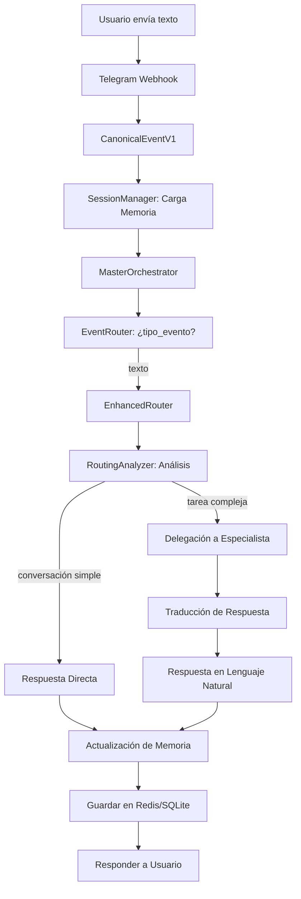
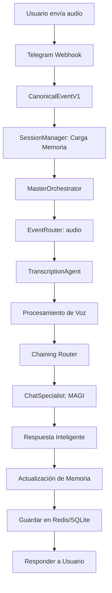

# Flujos de Datos de AEGEN

Este documento detalla los procesos secuenciales de datos para las interacciones principales del sistema.

## 1. Flujo Conversacional (Texto)

## 2. Flujo de Procesamiento de Audio

---
*Referencia: Evolución de Arquitectura v2.0*
